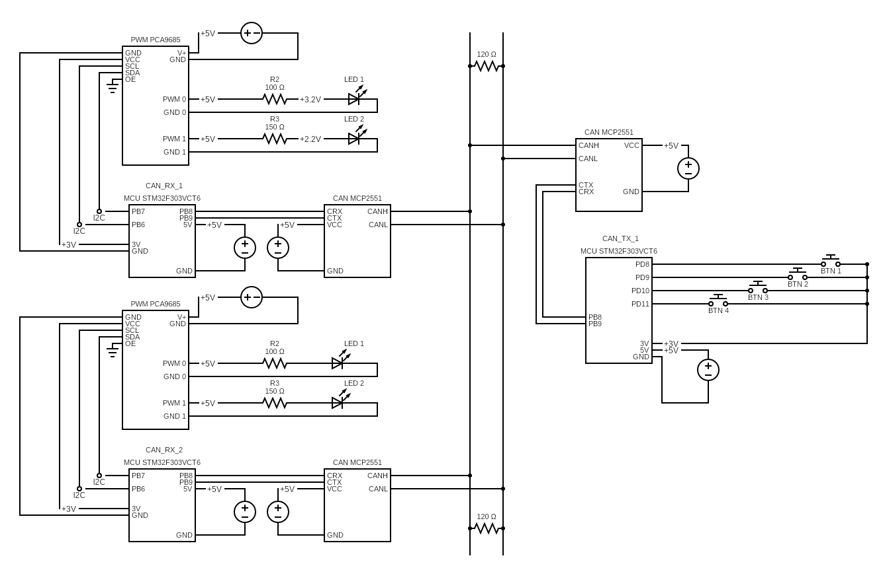

## Description
The project consists of a **CAN transmitter** (hereinafter CAN TX), **CAN receivers** (hereinafter CAN RX), **buttons**, **PWM chips** and **outer LEDs**
- The **CAN transmitter** is connected to the **buttons**. There are **4** buttons to select a *mode* of the headlights. Each button corresponds to the particular mode
- The **CAN TX** sends messages to a queue, that is read by each **CAN RX**
- The **CAN RX** processes the mode from the message and provides this info to the **PWM chip**
- The **PWM chip** coordinates the **LEDs**


## Schema


## Installation
- Download the **Standard Peripheral Library Expansion** for the `STM32F303VCT6` MCU
- Download the special **GCC** compiler for the **ARM** architecture
- Download the latest release of the `stlink` repository 
- Build `st-info` and `st-flash` binaries using `stlink` repository code
- Add to the `.zshrc` or `.bashrc` the following variables:
    ```
        # GCC ARM path 
        export PATH=$PATH:<path-to-dir-with-toolchain>/arm-gnu-toolchain-13.3.rel1-x86_64-arm-none-eabi/bin

        # ST-Link path 
        export STL_DIR=<path-to-dir-with-st-link>/stlink-1.8.0
        export PATH=$PATH:<path-to-dir-with-st-link>/stlink-1.8.0

        # STM32 SPL path
        export STM_LIB_DIR=<path-to-dir-with-spl/STM32F3-Discovery_FW_V1.1.0

    ```
- Check everything is installed correctly by running:
    ```
        arm-none-eabi-gcc --version
        st-info --version
    ```


## Build
- To build **elf**, **bin** and **hex** files run `make` command with the `TARGET_NAME` argument. Set `TX` value to compile code of the transmitter, `RX` - for receiver.
    ```
        make TARGET_NAME=TX
        make TARGET_NAME=RX
    ```

- To build the executable and flash it to the MCU:
    ```
        make flash TARGET_NAME=TX
        make flash TARGET_NAME=RX
    ```

## Static Analysis
- Download `cppcheck` version `2.13.0`
- To perform code static analysis run `make check TARGET_NAME=<TX|RX>`

## Asserts
User can enable/disable asserts in the project by providing `USE_ASSERTS` building parameter. For example: `make TARGET_NAME=RX USE_ASSERTS=1`